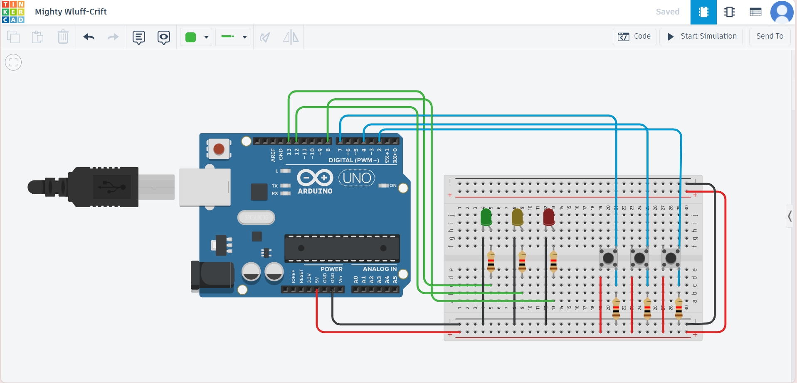

# 🚦 Arduino Traffic Light Controller


Interactive Arduino circuit simulation demonstrating multi-input control with LED outputs

## 🔗 Live Demo
[View on Tinkercad](https://www.tinkercad.com/things/6bm4NatIbXI-traffic-light-controller/editel?sharecode=A6mICp-pfuiCN9uDujCYF2uLX_V9RuQtjpWcp6OWL98)

## 💻 Arduino Code
```cpp
// C++ code
//
void setup()
{
   pinMode(7, INPUT);
   pinMode(4, INPUT);
   pinMode(2, INPUT);
   pinMode(13, OUTPUT);
   pinMode(12, OUTPUT);
   pinMode(8, OUTPUT);
}

void loop()
{
  if(digitalRead(7)==HIGH)
  {
  digitalWrite(13, HIGH);
  delay(1000); // Wait for 1000 millisecond(s)
  digitalWrite(13, LOW);
  delay(1000); // Wait for 1000 millisecond(s)
  }
  else if(digitalRead(4)==HIGH)
  {
  digitalWrite(12, HIGH);
  delay(1000); // Wait for 1000 millisecond(s)
  digitalWrite(12, LOW);
  delay(1000); // Wait for 1000 millisecond(s)
  }

  else if(digitalRead(2)==HIGH)
  {
  digitalWrite(8, HIGH);
  delay(1000); // Wait for 1000 millisecond(s)
  digitalWrite(8, LOW);
  delay(1000); // Wait for 1000 millisecond(s)
  }

  else
  {
    digitalWrite(13, LOW);
    digitalWrite(12, LOW);
    digitalWrite(8, LOW);

  }


}
```
# 🛠 Components

| Component          | Purpose                  |
|--------------------|--------------------------|
| Arduino UNO        | Main controller          |
| LED (x3)           | Visual output indicators |
| Push Button (x3)   | Digital input controls   |
| 220Ω Resistor (x3) | LED current limiting     |

## 🎯 How It Works

- **Button Mapping**:
  - `Button 1 (Pin 7)` → `LED 1 (Pin 13)`
  - `Button 2 (Pin 4)` → `LED 2 (Pin 12)`
  - `Button 3 (Pin 2)` → `LED 3 (Pin 8)`

- **Behavior**:
  - Pressing any button makes its corresponding LED blink at 1-second intervals
  - All LEDs automatically turn off when no buttons are pressed
  - Only one LED can be active at a time (mutually exclusive control)
